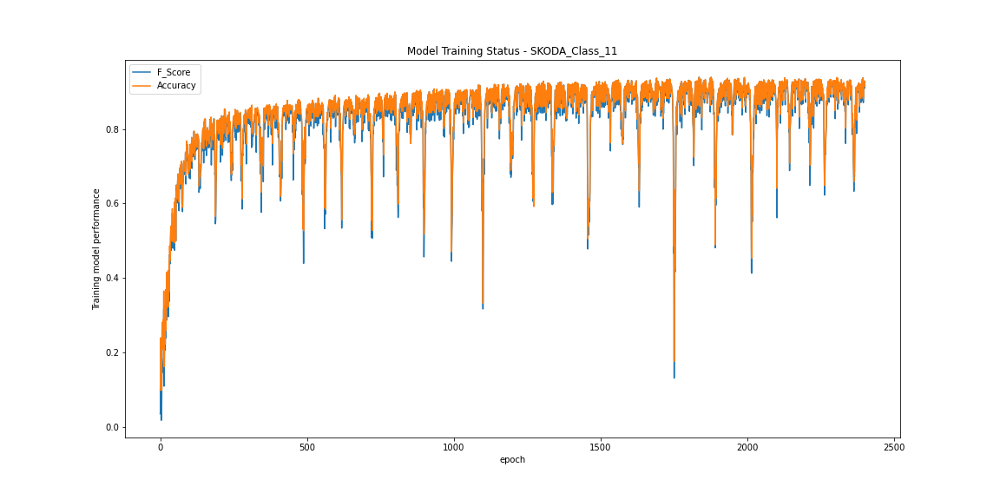

# CNN_LSTM_HAR_Pytorch
> Reprooduce Deep Convolutional and LSTM Recurrent Neural Networks for Multimodal Wearable Activity Recognition in pytorch
> Best performance: 92.8% F1 score on SKODA Dataset via 1300 epochs

## Table of contents
* [General info](#general-info)
* [Demo](#demo)
* [Technologies](#technologies)
* [Setup](#setup)
* [Features](#features)
* [Status](#status)
* [Inspiration](#inspiration)
* [Contact](#contact)

## General info
One dependency of machine learning supervised learning is large amount of labeled training data, sometimes it will be a bottom neck stops neural network’s performance going to next level. Introduction of Reinforcement learning enables an environment setup, with help of which model can create the training data by itself. Whole idea of Reinforcement learning simulates the way of human does, which designed to allow agent interacting with environment to gain knowledge/ agent talent. Not too difficult to understand, agent performance will not be enhanced into an expected direction without a score’s help to quantify how good/bad performance of recent game play by agent, as never forget the nature of Reinforcement learning is still supervised learning. Score acts as an exam role, of which result will become a new set training data for model to train a better performance agent next time. 

This project with the game chosen follows all terminology discussed above. Instead of computing out all combinations of game scenarios, its setups empowered a platform where allows latest trained agent to play against last version of its own. All steps will be recorded as new set of training data for further improvement. 

## Demo

## Technologies
* Python 3 - pytorch

## Setup
* Clone project into local folder
* Go to "MASTER CONTROL PANEL" inside Jupter notebook, select respective parameter before executing the script

parameter setup:

Please refer to "MASTER CONTROL PANEL" inside Jupter notebook for details

## Features
List of features ready:
* DeepConvLSTM model
* Data pre processing on dataset OPPORTUNITY and SKODA

To-do list:
* Please refer to "WIP" cell inside Jupter notebook for more details

## Status
Project is: _WIP_

## Inspiration
By https://www.mdpi.com/1424-8220/16/1/115

## Contact
Created by 'shaohongxu0509@gmail.com'